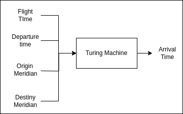

<h1 align="center">✈️ Turing Airlines Machine ✈️</h1>

<div align="center">
	<a href="link_for_webite">
	
    </a>
</div>

## Developed by 💻:

- [Fernando Schettini](https://linktr.ee/fernandoschett).

## About 🤔:

The GitHub project introduces two Turing Machines, MT1 and MT2, designed to calculate the arrival time at a destination based on flight duration, departure time, departure meridian, and arrival meridian (in degrees, with east and west indicators) all these parameters are represented in unary base. More details at the [report](https://github.com/FernandoSchett/turing_machine/blob/main/tm_dev_report_and_docs.pdf).

## Resourses 🧑‍🔬:

- MT1: classic single-tape Turing Machine it processes input data on a single tape to determine the arrival time at the destination.

- MT2: a new machine that introduces a two-tape Turing Machine with enhanced parallel processing capabilities. With dual tapes and transitions from the final state, MT2 show a simple example of how it can provide flexibility and computational efficiency.

## Results 📈:

## How to run it 🏃:

First, clone this repository. After that, simply execute the ```file_name``` file with the command:

    sudo command_for_running_project

## Screens 🎬:

<div align="center">
	<a href="">
	
    </a>
</div>
<h4 align="center">Figure 1 - Screens from the TM'S </h4>

## Logic Model 🧮:

Here's the logic model that represents how the turing machines work.

<div align="center">
	<a href="">
	
    </a>
</div>
<h4 align="center">Figure 3 - Turing machines logic model.</h4>

### Tools Used 🛠️: 

- [JFLAP](https://www.jflap.org/), for designing the TM's.  
- [Overleaf](https://pt.overleaf.com/), for writing the [report](https://github.com/FernandoSchett/turing_machine/blob/main/tm_dev_report_and_docs.pdf).  

## Licence 📜:

[Apache V2](https://choosealicense.com/licenses/apache-2.0/)

## References 📙:
	

[1] SIPSER, Michael. Michael. Introduction to the Theory of Computation. 2nd Edi-
tion. Boston: Thomson Course Technology, 2006.

[2] VIEIRA, Newton José. Languages and Machines: An Introduction to the Funda-
mentals of Computing. 1st Edition. Belo Horizonte: Department of Computer Science,
Institute of Exact Sciences, Federal University of Minas Gerais, 2004.

[3] GEEKS FOR GEEKS. Turing Machine as Comparator. Geeks for Geeks, 2023.
Available at: https://www.geeksforgeeks.org/turing-machine-as-comparator/
Accessed on: November 20, 2023.

